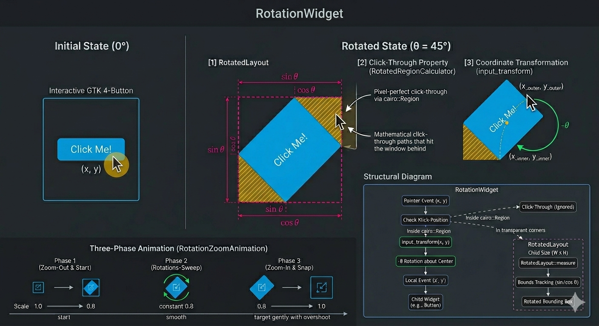
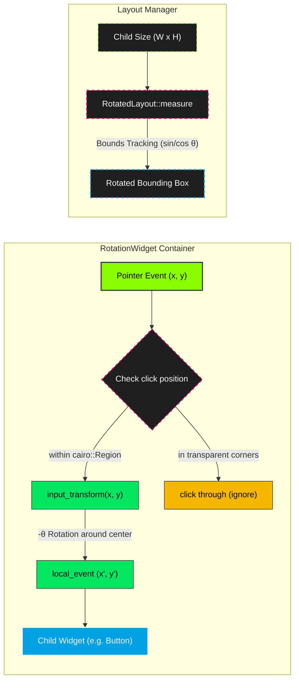

# Architecture

`RotationWidget` achieves hardware-accelerated rotation through four core components working together within the GTK4 layout and rendering pipeline.

## Overview

## Core Components

### 1. Custom Layout Manager (`RotatedLayout`)

`RotatedLayout` is a custom `gtk4::LayoutManager` subclass that handles size measurement and allocation of the rotated child widget.

**`measure`**: Computes the rotated bounding box using trigonometric bounds tracking. For a child with natural size $(W \times H)$ rotated by angle $\theta$, the bounding box dimensions are:

$$\text{bbox\_width} = W \cdot |\cos\theta| + H \cdot |\sin\theta|$$

$$\text{bbox\_height} = W \cdot |\sin\theta| + H \cdot |\cos\theta|$$

**`allocate`**: Applies a GSK transform matrix that:
1. Translates to the center of the bounding box
2. Applies the rotation angle
3. Applies the current scale factor
4. Translates back to position the child correctly

### 2. Inverse Coordinate Mapping (`input_transform`)

Because the child is physically rotated on screen, GDK's native event coordinates would deliver clicks to incorrect parts of the child. The `input_transform` function reverses the rotation:

1. Translate the input point relative to the widget center
2. Apply the inverse rotation matrix (using $-\theta$)
3. Translate back to absolute coordinates

This ensures buttons, sliders, text entries, and all interactive widgets inside the rotated container receive precise pointer events.

### 3. Pixel-Perfect Surface Input Masking (`RotatedRegionCalculator`)

When a widget is rotated at non-90° angles, the rectangular bounding box contains transparent corners. The `RotatedRegionCalculator` trait implements a rasterization line-scanning algorithm:

1. Compute the four corners of the rotated rectangle
2. For each scanline (y-coordinate), find the horizontal intersections with the rotated rectangle edges
3. Union the resulting horizontal strips into a `cairo::Region`
4. Apply the region to the window surface via `set_input_region()`

This makes transparent areas fully click-through — underlying windows receive pointer events in empty spaces.

### 4. Multi-Phase Animation System

The animation system consists of two animation types:

- **`RotationAnimation`**: Single-value animation with easing, used for basic rotation transitions. Computes the shortest angular delta to avoid unnecessary full rotations.
- **`RotationZoomAnimation`**: Three-phase animation combining rotation and scale, used by `set_rotation_with_animation()`.

#### Three-Phase Zoom Effect

When `set_rotation_with_animation()` is called, the widget executes a three-phase visual transition:

- **Phase 1 (0–33%)**: Zoom out from scale `1.0` to `0.8` while rotation begins, providing visual clearance.
- **Phase 2 (33–66%)**: Main rotation sweep at scale `0.8`.
- **Phase 3 (66–100%)**: Rotation completes and zoom back in from `0.8` to `1.0`.

#### Easing Functions

Three easing functions are available:

- **`Linear`**: Constant speed throughout.
- **`EaseInOut`**: Slow start and end, fast in the middle. Default for zoom animations.
- **`Overshoot`**: Spring physics with configurable `overshoot_amount` — the widget slightly overshoots the target before settling back.

## Input Transform Flow

