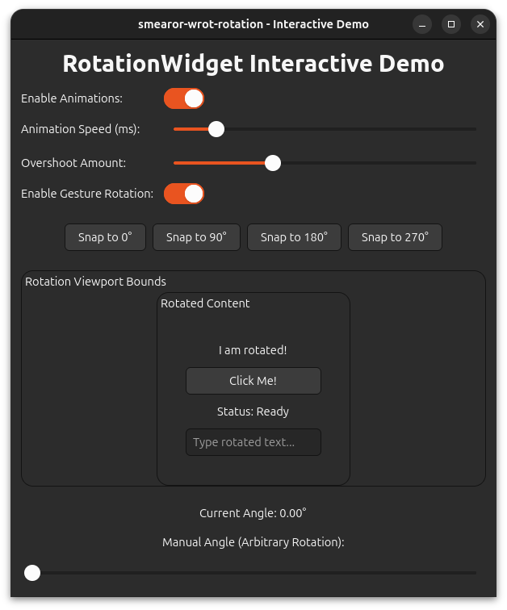
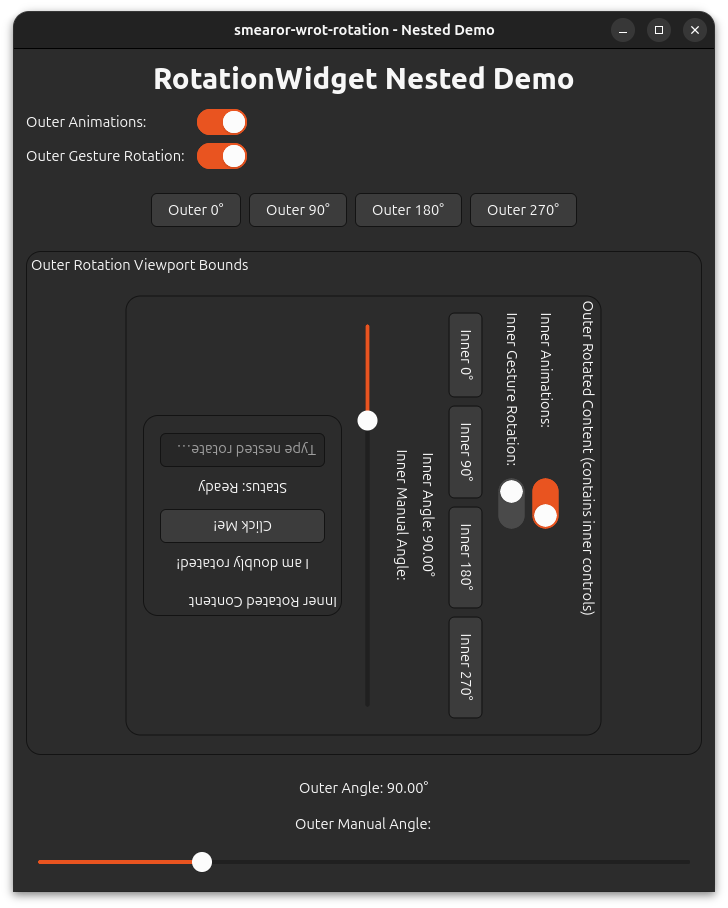

# Examples

The library ships with two example applications demonstrating the `RotationWidget` in action.

## Interactive Demo

A single `RotationWidget` with live controls for all configurable properties.



### Launch

```sh
cargo run --example interactive_demo
```

### Description

The interactive demo provides a control panel with:

- **Animation switch**: Toggle animations on/off
- **Speed slider**: Adjust animation duration (100–3000ms)
- **Overshoot slider**: Adjust spring overshoot intensity (0.1–5.0)
- **Gesture rotation switch**: Enable/disable two-finger twist gestures
- **Snap buttons**: Instantly rotate to 0°, 90°, 180°, or 270° with animation
- **Manual angle slider**: Set arbitrary rotation (0–360°) without animation

The rotated content contains interactive widgets (button, text entry, status label) to verify that coordinate transformation works correctly at all angles.

## Nested Demo

Two nested `RotationWidget` instances demonstrating that coordinate translation, input region masking, and animations work correctly in nested layouts.



### Launch

```sh
cargo run --example nested_demo
```

### Description

The nested demo features:

- **Outer widget**: Gesture rotation enabled, with its own snap buttons and manual angle slider
- **Inner widget**: Gesture rotation disabled by default to avoid gesture conflicts, with independent snap buttons and controls
- **Both widgets**: Independent animation, speed, and overshoot settings

The inner widget's controls are placed inside the outer rotation, so they rotate together with the outer widget. This demonstrates that:

1. Coordinate transformation works through multiple rotation layers
2. Input region masking correctly handles nested rotated bounds
3. Gesture rotation can be selectively enabled/disabled per widget to prevent conflicts
4. Interactive widgets (buttons, text entries) remain fully clickable at all nested rotation angles
